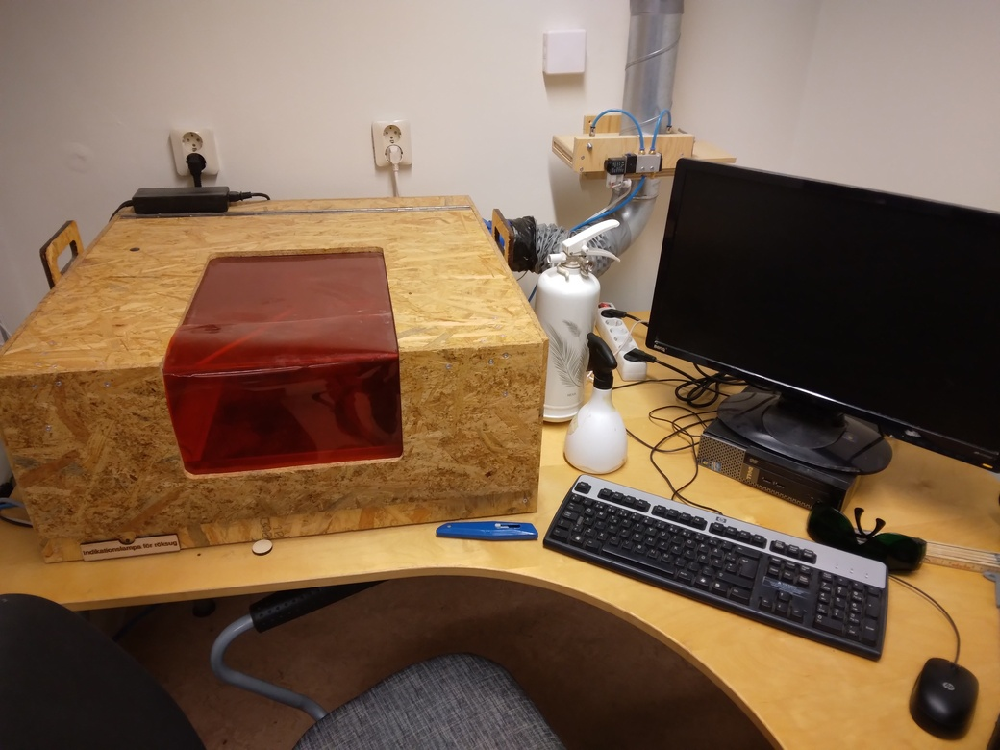

# Laser cutter guide

Manual for using the Uppsala Makerspacelaser cutter.

- [Website friendly](https://uppsala-makerspace.github.io/laser_cutter_guide/)
- Printer friendly: [A4](docs/pdfs/book.pdf) [A5](docs/pdfs/booklet.pdf)

[Contributions are welcome](https://uppsala-makerspace.github.io/laser_cutter_guide/CONTRIBUTING/)!

## Files used by continuous integration scripts

<!-- markdownlint-disable MD013 --><!-- Tables cannot be split up over lines, hence will break 80 characters per line -->

Filename                              |Descriptions
--------------------------------------|--------------------------------------------------------------------------------------------------------------------------------------
[mlc_config.json](mlc_config.json)    |Configuration of the link checker, use `markdown-link-check --config mlc_config.json --quiet docs/**/*.md` to do link checking locally
[.spellcheck.yml](.spellcheck.yml)    |Configuration of the spell checker, use `pyspelling -c .spellcheck.yml` to do spellcheck locally
[.wordlist.txt](.wordlist.txt)        |Whitelisted words for the spell checker, use `pyspelling -c .spellcheck.yml` to do spellcheck locally
[.markdownlint.jsonc](.markdownlint.jsonc)|Configuration of the markdown linter, use `markdownlint "**/*.md"` to do markdown linting locally. The name of this file is a default name.
[.markdownlintignore](.markdownlintignore)|Files ignored by the markdown linter, use `markdownlint "**/*.md"` to do markdown linting locally. The name of this file is a default name.

<!-- markdownlint-enable MD013 -->
