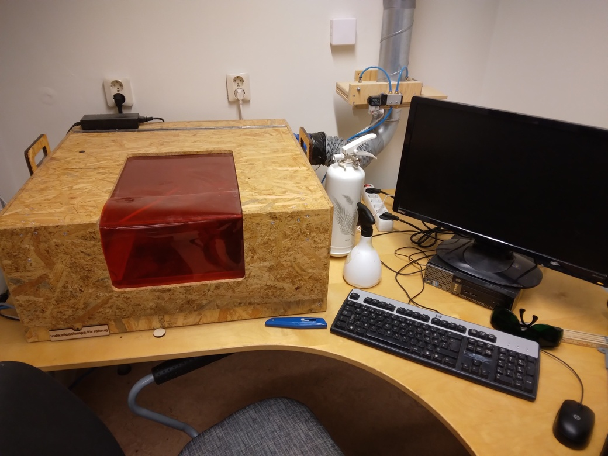

# Laser cutter guide

Manual for using the Uppsala Makerspace laser cutter.

 **The laser can blind you if used improperly.**

1. The coloured plastic does not prevent harm from the laser.
1. The laser cutter can (and will) operate in unsafe ways, there are no automatic safety systems in place.
1. Make sure you understand how to operate the laser cutter safely before doing so.

**When in operation do not look directly at the light without the appropriate safety goggles**.

- [Human friendly website](https://uppsala-makerspace.github.io/laser_cutter_guide/)
- [Printer friendly PDFs](docs/pdfs/README.md)

[Contributions are welcome](https://uppsala-makerspace.github.io/laser_cutter_guide/CONTRIBUTING/)!

## Files used by continuous integration scripts

<!-- markdownlint-disable MD013 --><!-- Tables cannot be split up over lines, hence will break 80 characters per line -->

Filename                              |Descriptions
--------------------------------------|--------------------------------------------------------------------------------------------------------------------------------------
[mlc_config.json](mlc_config.json)    |Configuration of the link checker, use `markdown-link-check --config mlc_config.json --quiet docs/**/*.md` to do link checking locally
[.spellcheck.yml](.spellcheck.yml)    |Configuration of the spell checker, use `pyspelling -c .spellcheck.yml` to do spellcheck locally
[.wordlist.txt](.wordlist.txt)        |Whitelisted words for the spell checker, use `pyspelling -c .spellcheck.yml` to do spellcheck locally
[.markdownlint.jsonc](.markdownlint.jsonc)|Configuration of the markdown linter, use `markdownlint "**/*.md"` to do markdown linting locally. The name of this file is a default name.
[.markdownlintignore](.markdownlintignore)|Files ignored by the markdown linter, use `markdownlint "**/*.md"` to do markdown linting locally. The name of this file is a default name.

<!-- markdownlint-enable MD013 -->
