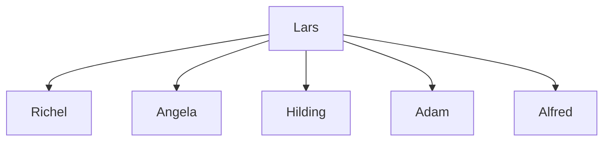

---
tags:
  - certified
  - operators
  - pedigree
---

# Certified operators

This is a list of certified operators
and the operators that they certified.

???- question "Why do we need an overview of the certified operator?"

    Because we expect certified operators to certify at least 2 others,
    so that the knowledge can spread.

Picture |Certified operator name|Certified by|Certification date
--------|-----------------------|------------|------------------
`[TODO]`|?Angela                |?Lars       |?
`[TODO]`|?Alfred                |?Lars       |?
`[TODO]`|?Hilding               |?Lars       |?
`[TODO]`|?Adam                  |?Lars       |?

