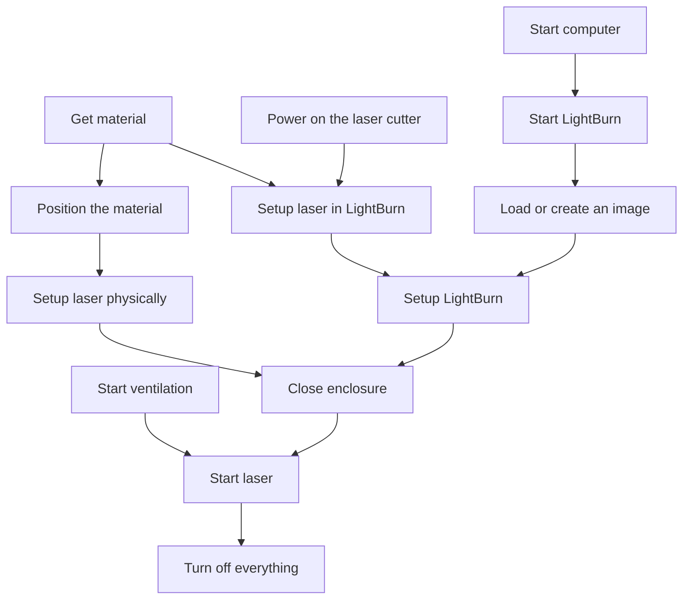

---
tags:
  - intro
  - introduction
  - overview
---

# Overview

The procedure on using the laser cutter is complex.
Here is an overview:

These are the steps:

- [Start ventilation](start_ventilation.md)
- [Power on the laser cutter](power_on_laser_cutter.md)
- [Start computer](start_computer.md)
- [Start LightBurn](start_lightburn.md)
- [Setup laser in LightBurn](setup_laser_in_lightburn.md)
- [Get material](get_material.md)
- [Position the material](position_material.md)
- [Setup laser physically](setup_laser_physically.md)
- [Load or create an image](load_image.md)
- [Setup LightBurn](setup_lightburn.md)
- [Close enclosure](close_enclosure.md)
- [Start laser](start_laser.md)
- [Turn off everything](turn_off_everything.md)

