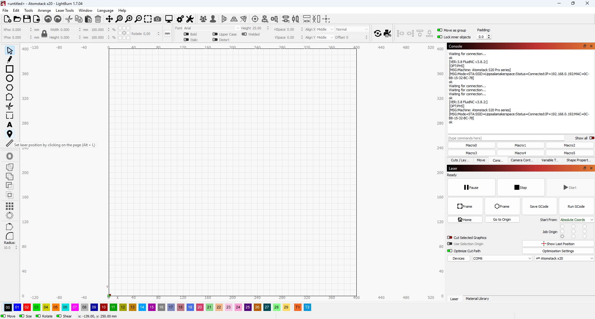
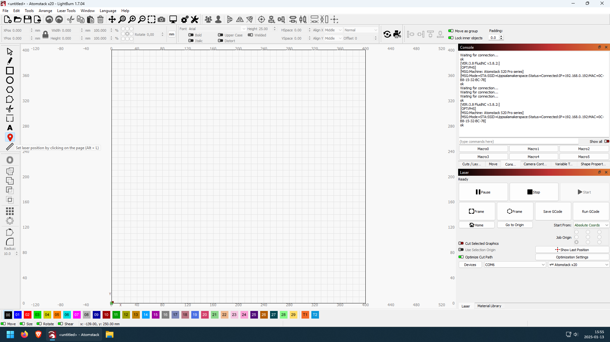

---
tags:
  - procedure
  - step
  - position
  - place
  - material
---

# Position material

Put the material in the enclosure.

## Setup the height of the laser


## Setup the frame of the cut

```text
Picture of material in the enclosure
```

Clicking the 'set Laser position' in LightBurn.



> Here is the LightBurn 'Set Laser position' tooltip

Now the 'Set laser position' icon is selected



> The 'Set laser position' icon is selected

Click somewhere at the bottom-left
