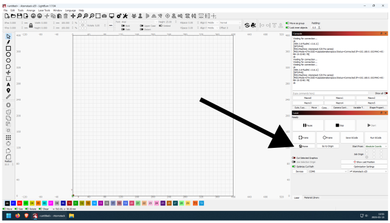

---
tags:
  - procedure
  - step
  - setup
  - laser
  - LightBurn
  - software
---

# Setup laser in LightBurn

To setup the laser in LightBurn:

- Connect the the laser cutter
- Home the laser

## Connect to the laser cutter

In LightBurn, click at the combo box right of 'Devices'.
It will probably say `COM1` or `COM4` or `COM6`.

> Pick a COM port here

Now The Dance starts. The Dance is picking different COM ports,
until a connection is established.

Select `COM1`.

> Select `COM1`

Observe the message 'Waiting for connection' at the top-right
(in the 'Console' tab).
If you need to wait for this connection longer than 3 seconds, The Dance
continues.

If The Dance needs to be continued, click `COM4`

> Select `COM4`

Observe the message 'Waiting for connection' at the top-right
(in the 'Console' tab).
If you need to wait for this connection longer than 3 seconds, The Dance
continues.

If The Dance needs to be continued, click `COM6`

> Select `COM6`

In this case, the message 'ok' is shown (in the 'Console' tab).
The Dance is over!

## Home the laser

Check that the laser can move to the front-left side
of the enclosure: that is where its home is. Always home it, even when its already in its corner. After homing it should say "ok" in console again. 

| Laser homing                              | Laser finished homing                              |
|:------------------------------------------|:---------------------------------------------------|
| |  |

Press the Home button to make the laser orient itself.

> Press home

The laser will move into the front left corner.

