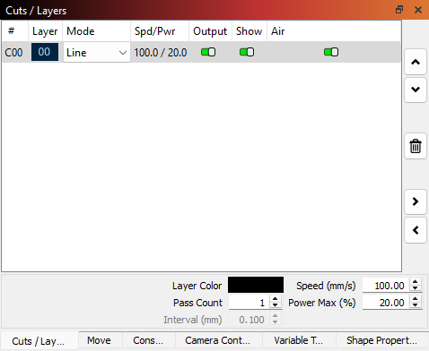
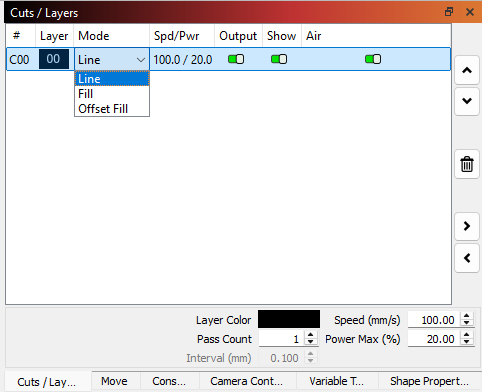
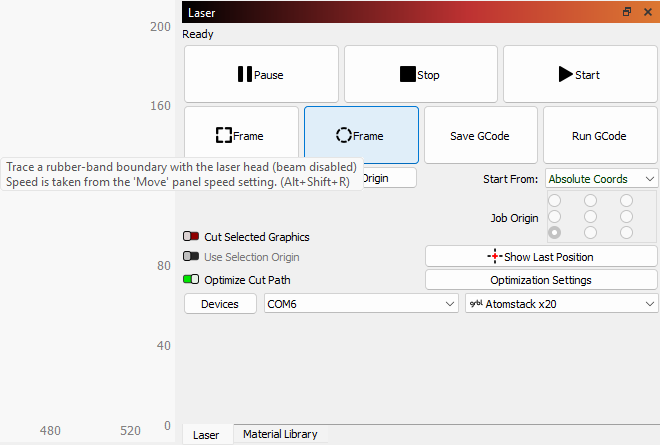

---
tags:
  - procedure
  - step
  - set up
  - setup
---

# Setup LightBurn

Here you set up:

- How the laser cuts
- Where the laser cuts

## How the laser cuts

The 'Cuts/Layers' tab determines how the laser cuts.
It is located at the top-right of the screen.

In the 'Cuts/Layers' tab, you can set the most important parameters per layer:

Parameter    |Description
-------------|---------------------------------------
Mode         |The mode of cutting, see below
Output       |Run the laser here yes/no
Show         |Show this color on the drawing
Air          |Have air on yes/no. Have this on for cuts
Speed (mm/s) |The speed of the laser
Power Max (%)|The power of the laser
Pass count   |How often the laser cuts each line

> Selet mode 'Line' to cut

Here are the modes:

Mode       |Description
-----------|---------------------
Line       |Cut through
Fill       |Will etch the surface
Offset fill|Hard to describe :-)

The pass count, speed and power differ per material.

Here is a list of know values:

Material                                  |Cut     |Pass count|Speed (mm/sec)|Power (%)
------------------------------------------|--------|----------|--------------|---------
Paper for oil and acryl painting, 290 g/m2|Complete|1         |10            |75
Paper for oil and acryl painting, 290 g/m2|Half    |1         |10            |20
Paper from printer                        |Complete|1         |10            |20
Paper from printer                        |Half    |1         |30            |25

You will have to find out your values by trail and error.
Please [contribute](../CONTRIBUTing.md)
the values for your favorite material.

## Where the laser cuts

The laser can show where it will cut.

:warning: This laser light is safe! It is at very low power.

In the 'Laser' menu, click 'Frame' (either the square or the oval one)
to see the contour of where the laser will cut:

Align the material with where the laser cuts, either by
moving the material or by moving the image in LightBurn or both.

