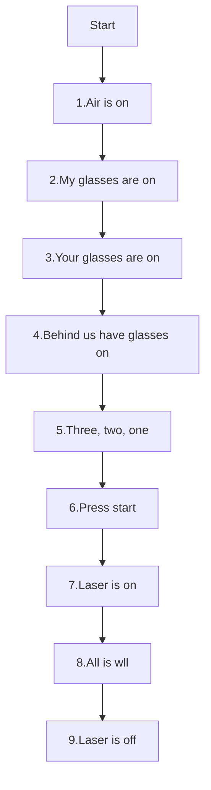

---
tags:
  - step
  - laser
  - start
---

# Start laser

Step|Do                                             |Check
----|-----------------------------------------------|-----------------------------------------
1   |Say 'Air in on'                                |The green light is on
2   |Say 'I am wearing my goggles'                  |You have your goggles on
3   |Say 'You are wearing your goggles'             |You assistant has his/her goggles on
4   |Say 'Those behind us are wearing their goggles'|All those behind you (if any) have goggles on
5   |Say '3, 2, 1'                                  |Nobody says 'stop'
6   |Press start                                    |Nobody says 'stop'
7   |Say 'Laser in on'                              |Laser is on, hand is on laser casing
8   |Say 'All is well'                              |No fire
9   |Say 'Laser is off'                             |Laser is on

