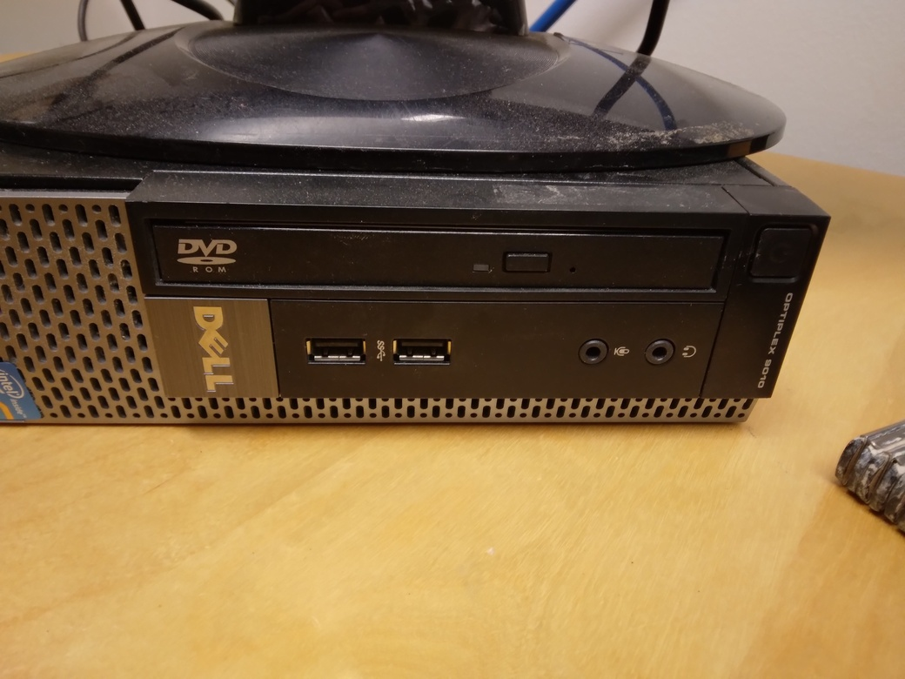

---
tags:
  - intro
  - introduction
  - overview
---

# Start computer

Press the computer's power button

> The computer's power button is at the top right

The computer will power up and show a login screen

> The login screen

Write the password in the rectangle.

> Write the password here and press enter

You have now started the computer!
