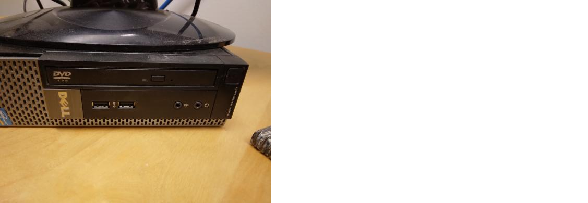

---
tags:
  - step
  - start
  - computer
---

# Start computer

Press the computer's power button, at the top right.

The computer will power up and show a login screen.

Write the password in the rectangle and press enter.

You have now started the computer!

\newpage
