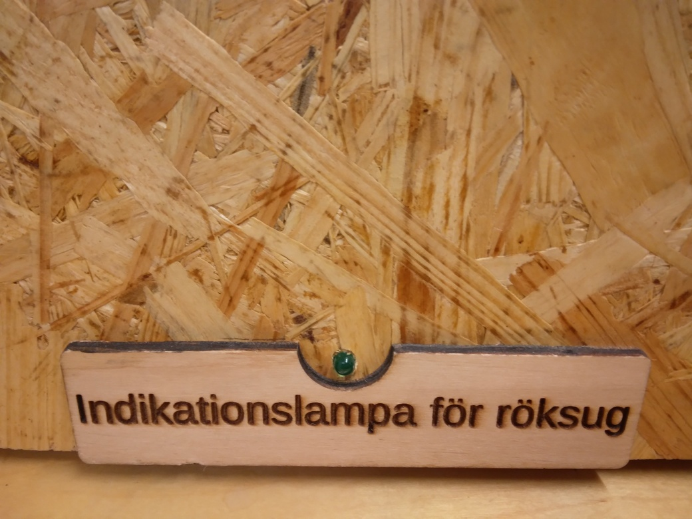
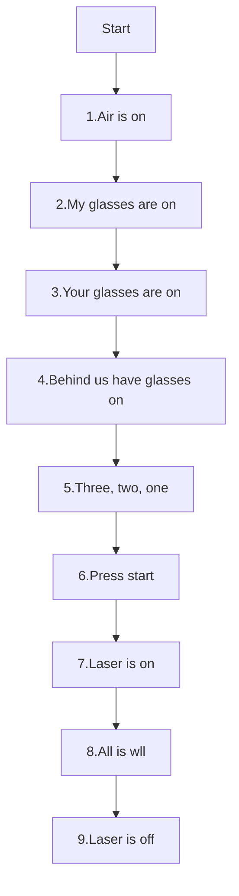

---
tags:
  - procedure
  - step
  - laser
  - start
---

# Start laser

## Operator procedure

Here is the operator procedure, which is described in detail below.

!!! info "The operator procedure"

    Step|Do                                             |Check
    ----|-----------------------------------------------|-----------------------------------------
    1   |Say 'Air is on'                                |The green light is on
    2   |Say 'I am wearing my goggles'                  |You have your goggles on
    3   |Say 'You are wearing your goggles'             |You assistant has his/her goggles on
    4   |Say 'Those behind us are wearing their goggles'|All those behind you (if any) have goggles on
    5   |Say '3, 2, 1'                                  |Nobody says 'stop'
    6   |Press start                                    |Nobody says 'stop'
    7   |Say 'Laser is on'                              |Laser is on, hand is on laser casing
    8   |Say 'All is well'                              |No fire
    9   |Say 'Laser is off'                             |Laser is off

### Step 1: Check air flow

The goal of this step is to check if the air flow is on.

Go?   |Check          |Image
------|---------------|-----------------------------------------------------
Yes   |Air flow is on |
No    |Air flow is off|

### Step 2: Check goggles of yourself

The goal of this step is to check if you yourself have your goggles on

Go?   |Check
------|--------------------------------
Yes   |You have your goggles on
No    |You do not have your goggles on

### Step 3: Check goggles of the other

The goal of this step is to check if the other has his/her goggles on

Go?   |Check
------|--------------------------------
Yes   |Other person has his/her goggles on
No    |Other person does not have his/her goggles on

### Step 4: Check behind

The goal of this step is to check if all people behind you have their goggles on

Go?   |Check
------|--------------------------------
Yes   |No people behind you
Yes   |All people behind you wear goggles
No    |Not all people behind you wear goggles

### Step 5: Countdown

The goal of this step is to allow the procedure to stop.

If somebody says 'stop', you stop.

### Step 6: Press start

In Lightburn, press 'Start' to start the laser.

### Step 7: Say 'Laser is on' and put hand on casing

Say 'Laser is on' and put your hand on the casing
as long as the laser is on.

Use your other hand to move the mouse cursor to 'Stop'.

### Step 8: Say 'All is well'

Repeatedly say 'All is well' when all is well.

If a fire starts or someone says 'Stop', click on stop. Laser is safe after stop 

### Step 9: Say 'Laser is off'

Say 'Laser is off'. You can remove your hand from the casing

## As a graph

