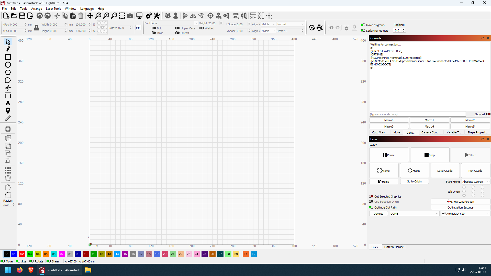

# Start LightBurn

At the desktop of the computer next to the laser,
there is a LightBurn icon at the left side of the desktop.

Double-click the LightBurn icon.

Now LightBurn starts.

This is how the first screen of LightBurn looks like:

Well done!
