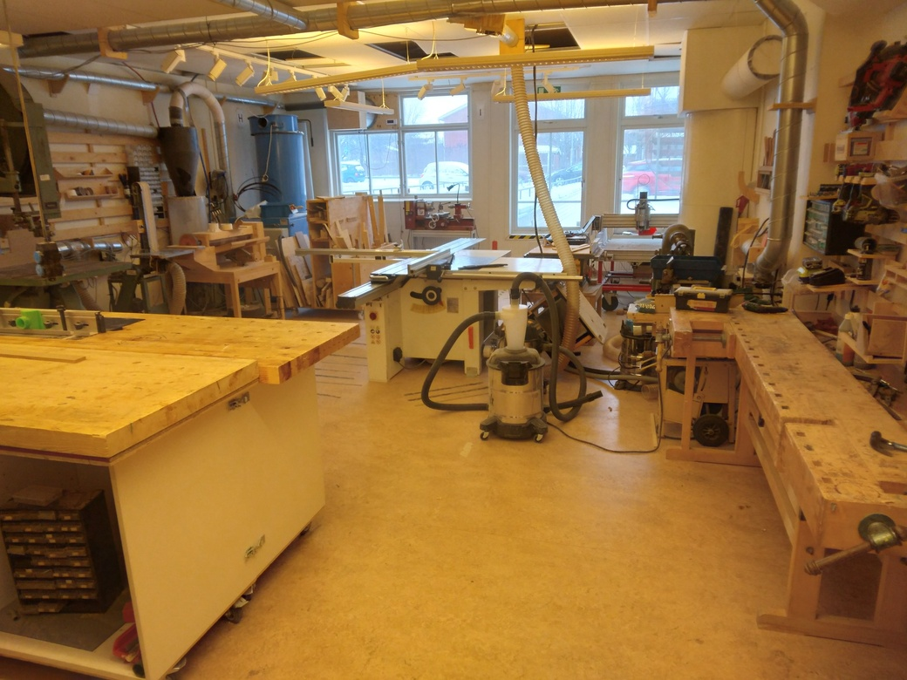
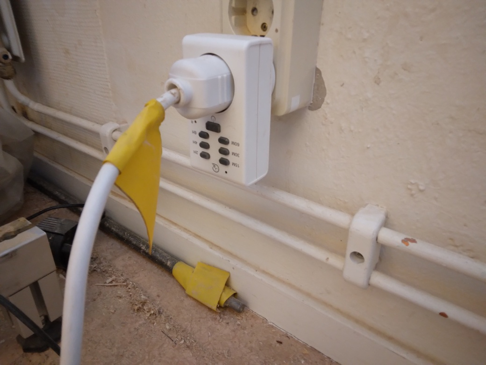

---
tags:
  - procedure
  - step
  - start
  - ventilation
---

# Start ventilation

In the woodshop, press the button to turn on the ventilation.

Go through the door of the woodshop:

> The door to the woodshop

Go to the back of the woodshop

> The woodshop

At the backside of the woodshop, find the timer.

> The backside of the woodshop

Go to the ventilation timer

> The ventilation timer

Press the button of the right duration on the ventilation timer:

- 15M: 15 minutes
- 2H: 2 hours

You should hear a noise start.
This is a compressor that will suck out the air from the laser cutter's
enclosure.
