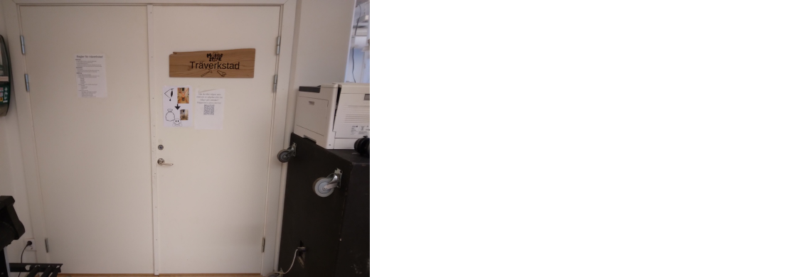
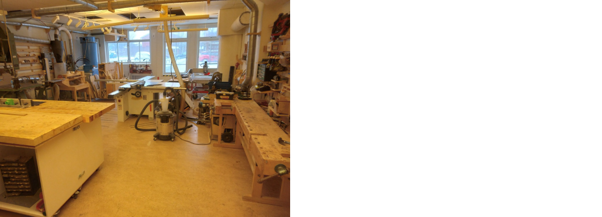
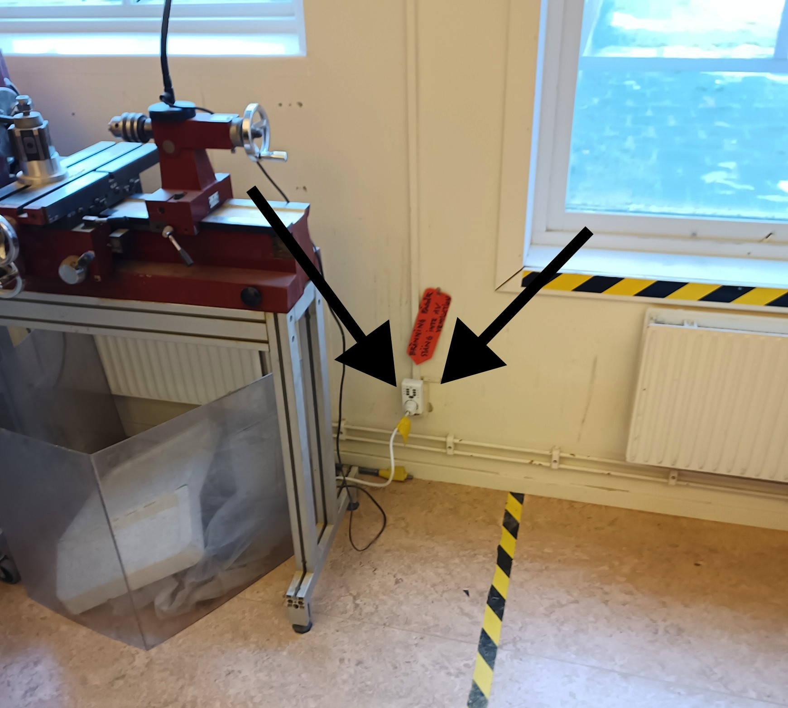
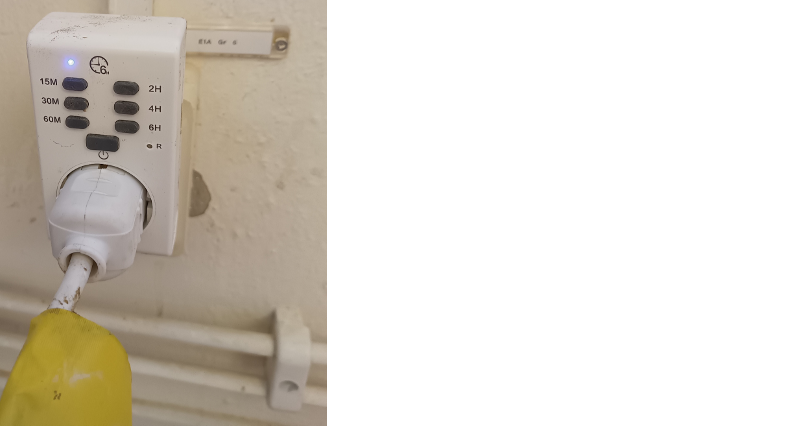
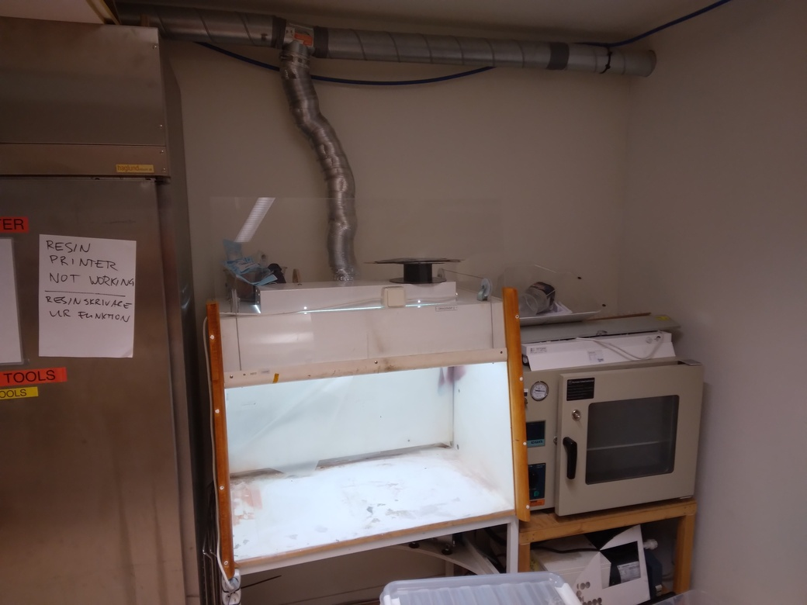
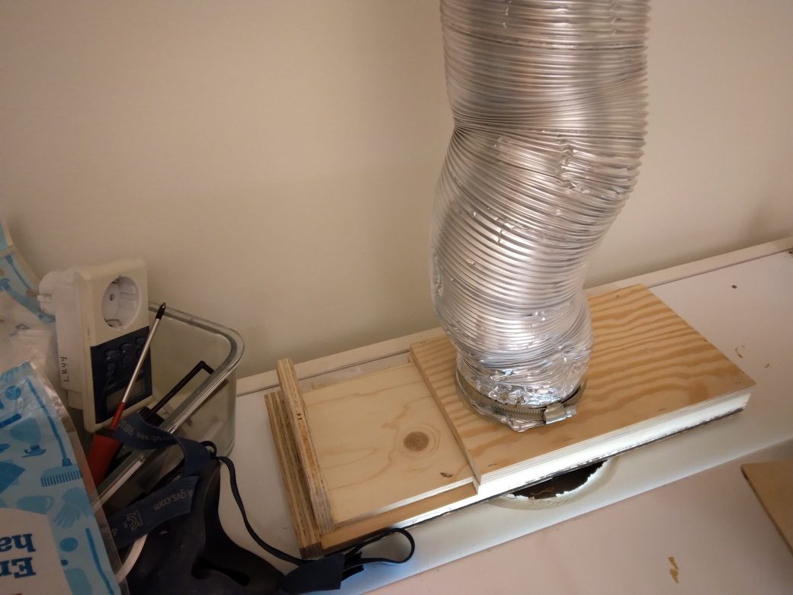
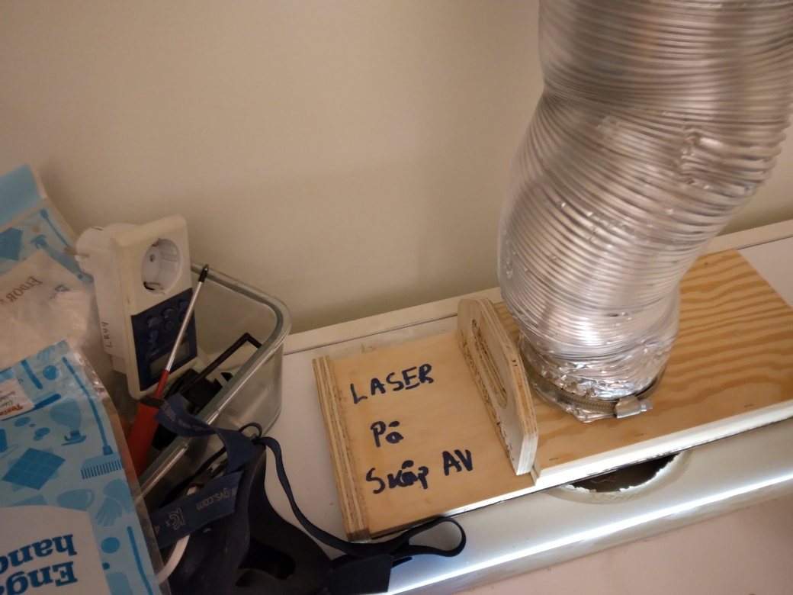

---
tags:
  - procedure
  - step
  - start
  - ventilation
---

# Start ventilation

Starting the ventilation has two steps:

- Turn on the ventilation
- Block the fume food

## Turn on the ventilation

In the woodshop, press the button to turn on the ventilation.

Find the door to the woodshop.

Go through the door of the woodshop. You are now in the woodshop.

At the backside of the woodshop, find the timer.

Go to the ventilation timer. Here is how it looks:

Press the button of the right duration on the ventilation timer:

- 15M: 15 minutes
- 2H: 2 hours

Now the ventilation timer is on and you will see a blue LED
light up.

You should hear a noise start.
This is a fan that will suck out the air from the laser cutter's
enclosure.

## Block the fume food

In the same room as the laser,
there is a fume hood, that
uses the same ventilation.
This is how the fume hood looks:

At the top of the fume hood, there is a slider.

How it looks                                                   |Description
---------------------------------------------------------------|----------------------------------------------------------------
|Air goes to the fume hood
        |Air goes to the laser

Change the slider to shut off the air to the fumehood, then more air gets sucked out of the laser.
