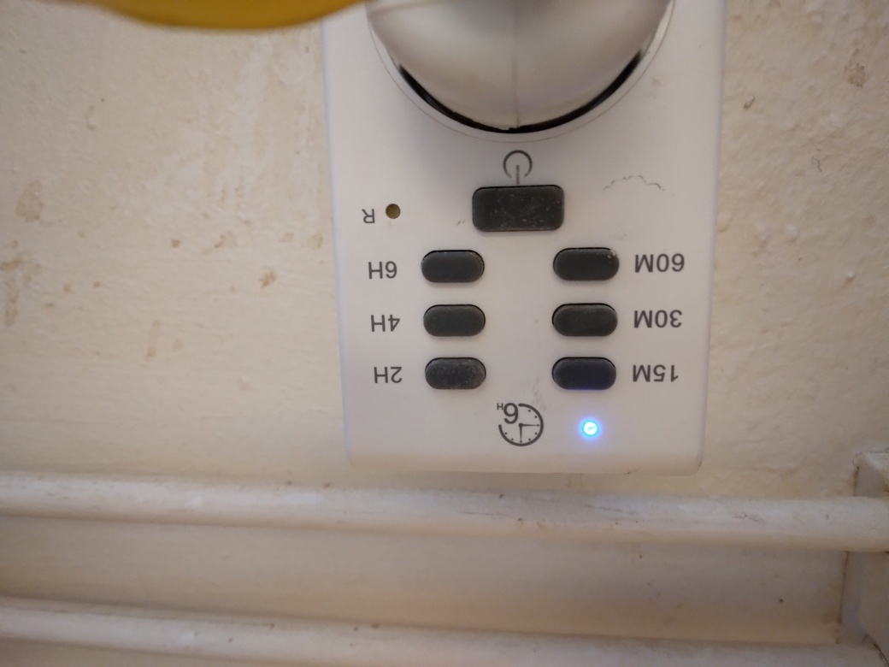

---
tags:
  - procedure
  - step
  - start
  - ventilation
---

# Start ventilation

Starting the ventiation has two steps:

- Turn on the ventilation
- Block the fume food

## Turn on the ventilation

In the woodshop, press the button to turn on the ventilation.

Go through the door of the woodshop:

> The door to the woodshop

Go to the back of the woodshop

> The woodshop

At the backside of the woodshop, find the timer.

> The backside of the woodshop

Go to the ventilation timer

> The ventilation timer

> The label on the ventilation timer

Press the button of the right duration on the ventilation timer:

- 15M: 15 minutes
- 2H: 2 hours

Now the ventilation timer is on.

> The ventilation timer is on

You should hear a noise start.
This is a fan that will suck out the air from the laser cutter's
enclosure.

## Block the fume food

In the same room as the laser,
there is a fume hood, that
uses the same ventilation.

> The fume hood

At the top of the fume hood, there is a slider.

How it looks                                                   |Description
---------------------------------------------------------------|----------------------------------------------------------------
|Air goes to the fume hood
        |Air goes to the laser

Change the slider on the fumehood so that the air goes to the laser cutter.
