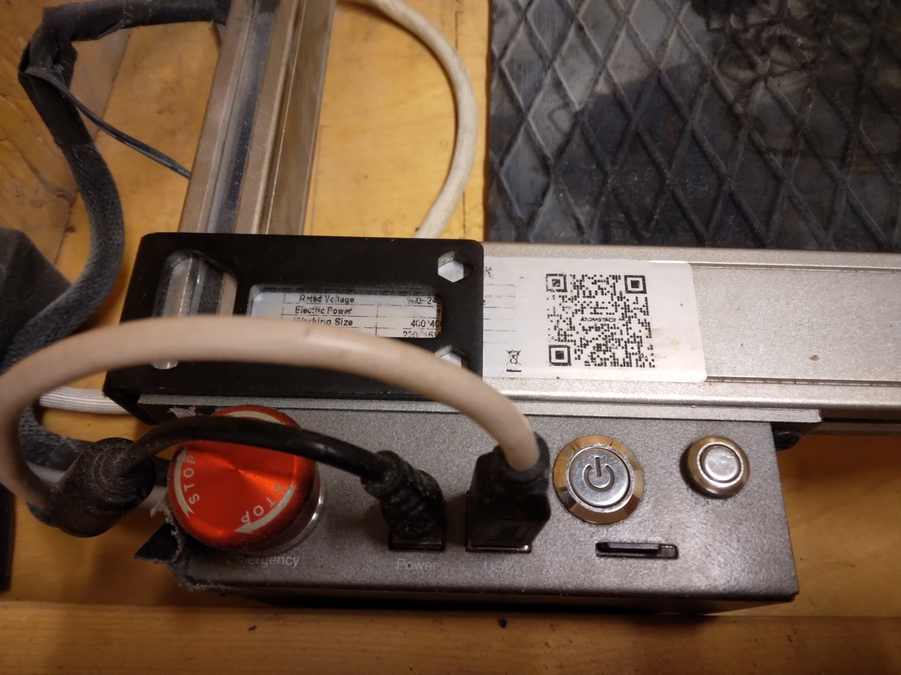

# Turn off laser

Make sure the laser is not in use.

Open the laser cutter.

> The opened laser cutter

The power button is on: it gives off a red light.

> The power of the laser cutter is on

Press the power button.

Now to power button is off.

